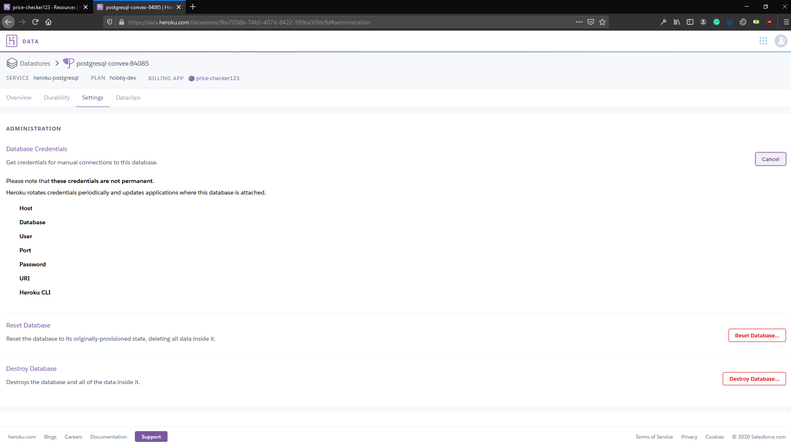

# Discord Bot Template with Postgresql Database

## Table of Contents

- [About](#about)
- [Getting Started](#getting_started)
    - [Prerequisites](#getting_started)
    - [Inviting The Bot To Your Server](#invite)
    - [Environment Variables](#env_var)
    - [Installing](#installing)
- [Running](#running)
- [Migrating To Heroku](#heroku)


# About <a name = "about"></a>

This Discord Bot template will get you started making a bot with many reusable commands.

It comes with a postgresql database of members with a command parser and message listener to perform CRUD operations on the table.

# Getting Started <a name = "getting_started"></a>

These instructions will get you a copy of the project up and running on your local machine.

# Prerequisites <a name = "pres"></a>


This project runs on Node.js. You'll need to download and install it before moving on.


https://nodejs.org/en/download/

Run this command to check that node has been correctly installed:
```javascript
node --version
> v12.18.3
```

Now install PostgreSQL on your local machine:

https://www.postgresql.org/download/

Remember the password you choose here when you go through the installation process. You will need to use it in your code.


-----
\
The first step in installing and using a bot is creating an application in the [Discord Developer Portal](https://discord.com/developers/applications).

<br>

1. Click the `New Application` button to create a new bot.


<br>
<br>

2. Give it a name and click `Create`


<br>
<br>

3. Navigate to the Bot tab and click to `Add Bot`.


<br>
<br>

4. Now `Click to Reveal Token`. You'll need to paste this token into your pw.env file (which will be explained later on in this guide).


<br>

<br>
<br>

__Never share this token with anyone! It is used to authenticate your bot! It is your bot's password.__ Anyone with access to this token will have *full* control over the bot. That means that if you have granted the bot an admin role on your server, __anyone with access to your token will have admin rights on your server__. If you ever happen to lose your token, you may go back to the [Developer Portal](https://discord.com/developers/applications) on your bot's page and click the button to _regenerate_ a new one. Paste it into your `pw.env` file and you'll be good to go!

# Inviting The Bot To Your Server <a name="invite"></a>
Follow these instructions on how to format your invite link: https://discordjs.guide/preparations/adding-your-bot-to-servers.html#bot-invite-links

You'll find your client id back in the Developer Portal under the __General Information__ tab.
Once you have your invite link, you can simply paste it into the browser and invite the bot to your server.

Your invite link should look something like this:
```javascript
https://discord.com/oauth2/authorize?client_id=123456789012345678&scope=bot
```

# Environment Variables <a name = "env_var"></a>
The environment variables listed below are stored in your __pw.env__ file. You will notice a single file that exists within the root directory of this codebase called __pw.envEXAMPLE.__ Here is where you can customize your bot. The only requirements are that you input the correct token for your bot and ACTIVITY_TYPE is limited to only 3 choices. Besides those limitations, you have a number of variables to choose from to make the bot fit your server's personality. See below for definitions of what they all mean.

|__TOKEN__| Is found in the Discord Developer Portal when you created your bot.\
|__MY_USER_ID__| Is used to filter commands from only yourself.\
|__SET_USERNAME__| Is used to set the bot's username programmatically in the code.\
|__PREFIX__| Command prefix used by the command parser utility.\
|__PGUSER__| The username you use to login to your Postgres server - defaults to postgres.\
|__PGPASS__| Password you chose when setting up your Postgres installation.\
|__PGPORT__| Defaults to 5432.\
|__PGURL__| Set this as: "localhost" if you are running locally.\
|__DBNAME__| Make sure you create the database in the terminal before attempting to connect from in the code!

-----

```JAVASCRIPT
TOKEN='?????'

MY_USER_ID='??????'

SET_USERNAME='TESTO!TESTO!TESTO!'
PREFIX='!'


# DATABASE CONNECTION
PGUSER='postgres'
PGPASS='????'
PGPORT='5432'
PGURL='localhost'
DBNAME='testo'
```

# Installing <a name = "installing"></a>


Once Node has been installed, you have your application created in the [Discord Developer's Portal](https://discord.com/developers/applications), the bot is invited to your server and granted a role with the correct permissions, download the bot's source code. Fill in your environment variables as explained above.

Before running the app, you need to use npm to install packages required to run a Discord bot in JavaScript.

To do so, first you must open your terminal, and `cd` into the folder containing the bot. Now run this command from the root folder:
```javascript
npm install
```

This command will install all the nececary dependencies as defined in the `package.json` file.

Once these packages are completely installed, you will be only one step away from running your bot.

# Running <a name = "running"></a>

Now that you've generated a token for a new app, your environment variables have bet set, and you've installed the dependencies, you are ready to run the bot!

To run the bot, simply use this command:
```javascript
node src/app.js
```

# Migrating To Heroku

1. Create new app in your dashboard.


2. Name it and add it to a pipeline


3. Connect it to GitHub in the `Deploy` tab.


4. Deploy from GitHub


5. Add a database in the `Resources` tab


6. Get your database info here



7. Update your Config Vars in `Settings` tab.


Update your config vars to the ones in the `.envEXAMPLE` file in this repo.